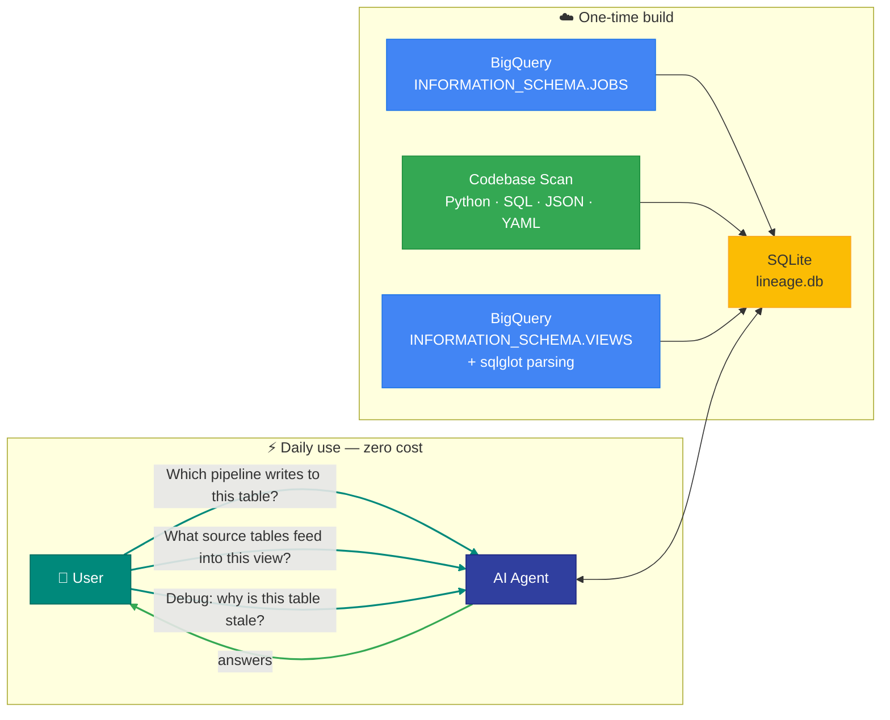

# claude-code-lineage-explorer

A Claude Code skill that builds BigQuery table lineage from your codebase and INFORMATION_SCHEMA metadata. One command to map every pipeline to every table.



## Why

- **Debugging is slow without lineage** — Something breaks in a dashboard. The first question is always "which pipeline writes to this table?" Without lineage, you're searching through code, tracing table names across files, and asking teammates. With 50+ pipelines, this takes 20-30 minutes every time.

- **Existing tools require framework lock-in** — dbt lineage, Dataplex, and OpenLineage all require adopting a specific platform. If you're using Airflow, Prefect, Dagster, cron jobs, or plain Python scripts with BigQuery, there's no lightweight option that works with your existing codebase.

- **AI-assisted debugging is expensive without local lineage** — When you debug a data issue with an AI agent, every lineage question can trigger multiple BigQuery queries — scanning job history, reading view definitions, searching across datasets. Those queries add up fast in both cost and time. This skill builds the lineage once and stores it locally. After that, every question is answered from SQLite — zero BigQuery cost, instant results.

- **Zero infrastructure** — No servers, no deployments, no connection strings. One command produces a single SQLite file that lives in your repo.

## Use Cases

- **Incident response**: A table has bad data — instantly find which pipeline writes to it and what source tables feed into it
- **Impact analysis**: Before changing a table schema, find every downstream pipeline and view that depends on it
- **Pipeline debugging**: Trace the full dependency chain from a dashboard table back to raw source tables
- **Onboarding**: New team members can explore the entire data pipeline topology without reading every DAG file
- **Migration planning**: Identify which pipelines touch a dataset before moving or deprecating it
- **Audit and compliance**: Know who (which service account or user) last wrote to a table and when

## Install

Open Claude Code and paste:

```
Install this skill: https://github.com/drharunyuksel/claude-code-lineage-explorer
```

Claude will read the repository and set up the skill for you.

## Prerequisites

- **A BigQuery MCP tool** configured in your Claude Code settings. Any MCP server that can run read-only BigQuery queries will work. For example, [mcp-bigquery](https://github.com/ergut/mcp-bigquery) is a lightweight, read-only option.
- Read access to `INFORMATION_SCHEMA.JOBS` and `INFORMATION_SCHEMA.VIEWS` in your BigQuery project

## Usage

Navigate to your data project repo and run:

```
/lineage-explorer
```

On the first run, the skill builds the lineage database in four steps:

1. **Query BigQuery job history** — Reads `INFORMATION_SCHEMA.JOBS` from the last 60 days to find every write operation (INSERT, MERGE, CREATE TABLE). For each write, it captures the target table, source tables, the pipeline that triggered it (from Airflow job labels or user email), and timestamps.

2. **Scan your codebase** — Walks through your Python, SQL, and config files to find BigQuery table references. For Airflow repos, it extracts `dag_id` from DAG definitions, config files, and `Variable.get()` references, then maps each DAG to its target tables. For non-Airflow repos, it groups tables by file path.

3. **Parse view definitions** — Queries `INFORMATION_SCHEMA.VIEWS` to get the SQL behind every view, then uses [sqlglot](https://github.com/tobymao/sqlglot) to parse the SQL and extract source table dependencies. This reveals the full dependency chain for views without relying on job history.

4. **Write to SQLite** — Combines all three sources into a local `lineage.db` file. No cloud infrastructure, no external services — just a SQLite database you can query instantly.

### Refresh Behavior

The skill doesn't rebuild every time — it checks the database age first:

- **Less than 7 days old** — Skips the build, queries the existing database directly. You'll see: "Lineage database is current (last updated N day(s) ago)."
- **7 or more days old** — Asks if you'd like to refresh before answering.
- **Explicit refresh** — Force a rebuild anytime with `/lineage-explorer refresh`.

The 7-day threshold can be changed in `.lineage-explorer.json` with `"refresh_after_days": N`.

## What It Builds

The skill combines three data sources into a single lineage graph:

| Source | What it captures |
|---|---|
| **BQ job history** | Which pipeline wrote to which table, when, from which sources |
| **Codebase scan** | Pipeline-to-table mappings from code (covers jobs without labels) |
| **View definitions** | Source tables for every view, parsed with sqlglot |

## Output

```
Lineage scan complete.

  Orchestrator:  Airflow (58 DAGs detected)
  Tables:        412
  Views:         247
  Pipelines:     39
  Datasets:      14
  Sources:       job_history (156), codebase_scan (259), view_definition (247)

  Database:      ./lineage.db
```

## Ask Questions in Natural Language

Once the lineage database is built, just ask Claude in the same session:

```
Which pipeline writes to the users table?
```
```
What are the source tables that feed into the orders_summary table?
```
```
Show me all tables in the reporting dataset and which ETLs create them.
```
```
Which tables does the daily_sync DAG write to?
```
```
What views depend on the transactions table?
```
```
Who last wrote to the inventory table and when?
```

Claude queries the local `lineage.db` to answer — no BigQuery cost, instant results.

## SQLite Queries

You can also query `lineage.db` directly:

```bash
# Which pipeline writes to a specific table?
sqlite3 lineage.db "SELECT pipeline_id, edge_source FROM lineage WHERE target_name = 'users'"

# What source tables feed into a target?
sqlite3 lineage.db "SELECT source_tables FROM lineage WHERE target_name = 'users'"

# Show all tables in a dataset and their pipelines
sqlite3 lineage.db "SELECT target_name, pipeline_id FROM lineage WHERE target_dataset = 'financial_dashboard'"

# Summary of all tables and their pipelines
sqlite3 lineage.db "SELECT * FROM table_summary ORDER BY target_dataset, target_name"

# All tables written by a specific DAG
sqlite3 lineage.db "SELECT target_dataset, target_name FROM lineage WHERE pipeline_id = 'my_etl'"
```

## SQLite Schema

```sql
CREATE TABLE lineage (
  target_dataset  TEXT NOT NULL,
  target_name     TEXT NOT NULL,
  target_type     TEXT NOT NULL,    -- 'TABLE' or 'VIEW'
  source_tables   TEXT,             -- JSON array of 'dataset.table' strings
  pipeline_id     TEXT,             -- dag_id (Airflow) or file path (generic)
  pipeline_type   TEXT,             -- 'airflow_dag' or 'script'
  edge_source     TEXT NOT NULL,    -- 'job_history', 'codebase_scan', 'view_definition'
  write_pattern   TEXT,             -- 'MERGE', 'INSERT', 'CREATE_TABLE_AS_SELECT', etc.
  view_definition TEXT,             -- SQL text (views only)
  first_seen      TEXT,
  last_seen       TEXT,
  job_count       INTEGER,
  user_email      TEXT
);
```

## Configuration

The skill works with zero configuration for standard setups. Optionally create `.lineage-explorer.json` in your repo root:

```json
{
  "project_id": "my-gcp-project",
  "location": "US",
  "lookback_days": 60,
  "dags_dir": "dags",
  "exclude_datasets": ["_temp", "_staging"],
  "db_path": "lineage.db"
}
```

## Orchestrator Support

- **Airflow**: Extracts `dag_id` from decorators, `DAG()` constructors, `Variable.get()` configs, and JSON config files. Enhanced lineage with pipeline attribution.
- **Generic**: Works with any orchestrator (Prefect, Dagster, cron, raw scripts). Groups tables by file path.

## Data Warehouse Support

This skill is designed and tested for **BigQuery**. It queries BigQuery's `INFORMATION_SCHEMA` and parses BigQuery SQL dialect.

However, since this is a Claude Code skill (not compiled code), your AI agent can adapt it for other data warehouses. Try prompting:

```
Install this skill for our Snowflake warehouse: https://github.com/drharunyuksel/claude-code-lineage-explorer
```

Claude will read the skill, understand the approach, and modify the `INFORMATION_SCHEMA` queries and SQL parsing to match your warehouse's syntax.

## What's Next

Want lineage in your data warehouse alongside local SQLite — so your whole team can query it? You can ask Claude to generate an ETL (Airflow, Prefect, cron, or any scheduler) that writes the same lineage data to a BigQuery, Snowflake, or Redshift table on a schedule.

## License

MIT
